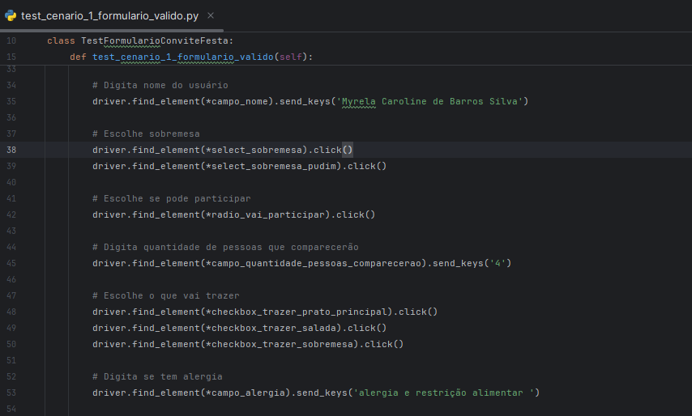
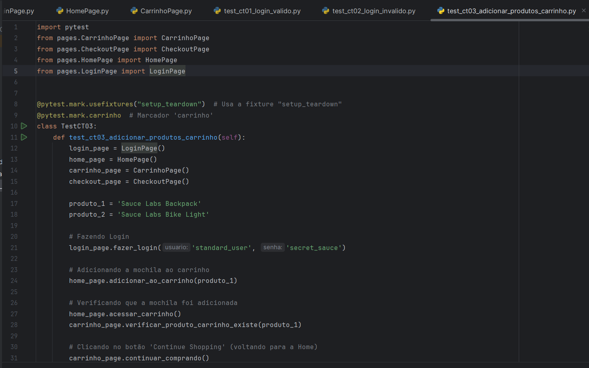

# Grupo MGO - Desafio Tester Júnior

 
> Teste prático para Analista de QA

 Projeto realizado durante o desafio para Analista de QA Júnior do grupo **MGO**.
 
## 📚 Tópicos

- Plano de teste
- Teste manual
- Teste automatizado

## 🔧 Ferramentas e Tecnologias

- Python (`v3.11.5`)
- Selenium (`v4.17.2`)
- Pytest (`v8.0.0`)
- pip (`v24.0`)

## 🔧 Testes

- Execute `pytest .\tests\test_ct01_login_valido.py` para executar o teste no modo interativo.
- Execute `pytest .\tests\test_ct02_login_invalido.py` para executar o teste no modo interativo.
- Execute `pytest .\tests\test_ct03_adicionar_produtos_carrinho.py` para executar o teste no modo interativo.

## 🔗 Contato

mykallella@gmail.com
